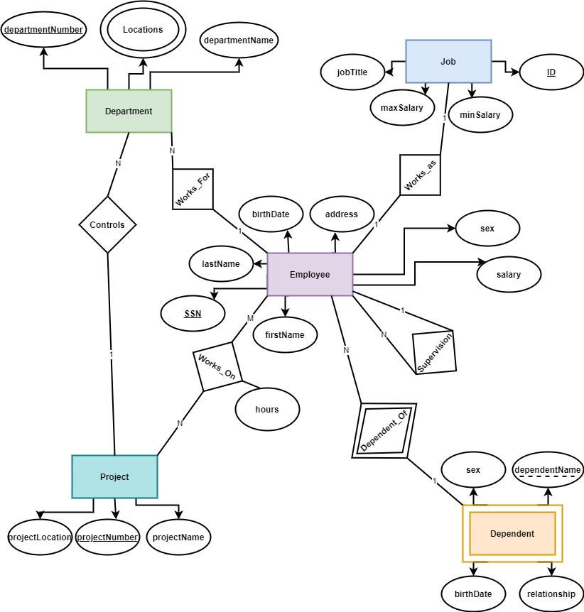
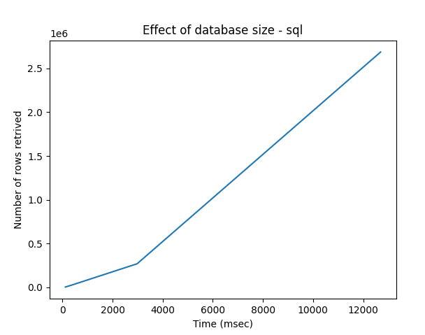
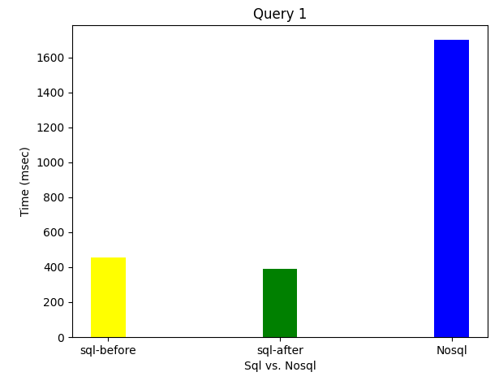
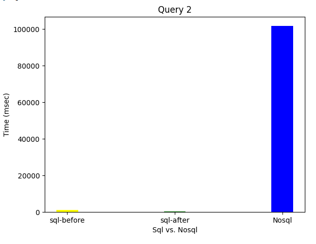
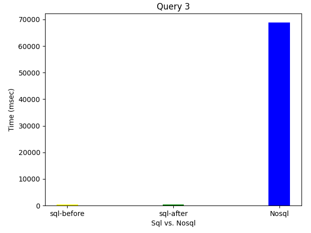
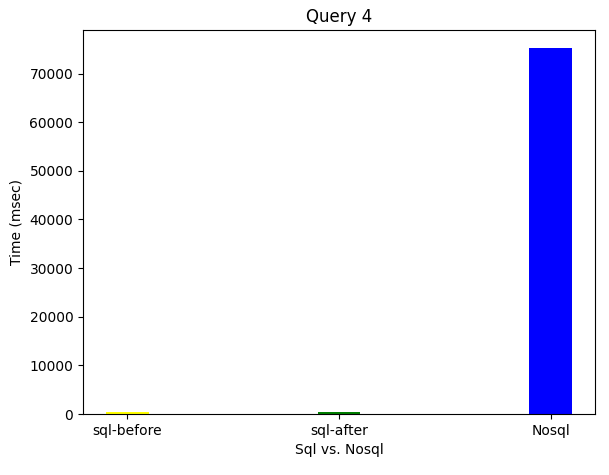
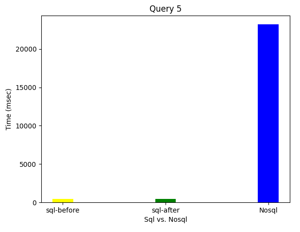

# Query-Optimization
## **ER Diagram**

## 1. *Optimization Details*
After the addition of the new indexes and rerunning database statistics queries, we compiled a new report. The report is shown below. 
|**Table Name**|**Row Count**|**Main Key**|**Indexes**|**Foregin Key**|**Identity Column**|**Max Row Size (Bytes)**|
| :- | :- | :- | :- | :- | :- | :- |
|**Department**|1000000|Yes|2|0|No|33|
|**Department\_Location**|2000000|Yes|1|1|No|50|
|**Dependent\_Employee**|5000000|Yes|2|1|No|44|
|**Employee**|10000000|Yes|4|3|No|100|
|**Job**|4000000|Yes|2|0|No|36|
|**Project**|8000000|Yes|1|1|No|34|
|**Works\_On**|9000000|Yes|2|2|No|19|

### **Schema Enhancement** 

After that we modify our schema as the following:

1. Remove the Department\_Location table and replace it with a multivariable attribute in the department table that enhances query 3.
2. Add the attribute (Job\_title) to the employee table that enhances query 4.

### **Memory Enhancement (Stored Procedure):**

We used stored procedures for some queries to save the execution plan for them and don’t recalculate it every time and that saves time as well as the caches.

Which increases the performance to be **40.15%** instead of **19.16%** for **Query 1**.
 

## 2. *Validation Details*

### **Enhancement in time**

||**Query Modification**|**Index Tuning** |**Schema Enhancement**|**Memory Enhancement**|**Total Optimization**|
| :- | :- | :- | :- | :- | :- |
|Query 1|34.96%|14.89%|-|19.16%|38.84%|
|Query 2|99.79%|-|-|11.99%|99.79%|
|Query 3|4.045%|30.02%|40.23%|21.31%|34.52%|
|Query 4|37.77%|22.44%|9.31%|26.01%|46.53%|
|Query 5|12.57%|19.14%|-|37.34%|20.45%|

### **Enhancement in memory cache**

||**Total Optimization**|
| :- | :- |
|Query 1|37.50%|
|Query 2|-63.63%|
|Query 3|0%|
|Query 4|43.75%|
|Query 5|30.00%|

### **Effect of Database Size on Performance – SQL after Optimization**
 

**Query (1) – SQL & NOSQL Comparison**
 

**Query (2) – SQL & NOSQL Comparison**
 

**Query (3) – SQL & NOSQL Comparison**
 

**Query (4) – SQL & NOSQL Comparison**
 

**Query (5) – SQL & NOSQL Comparison**
 

